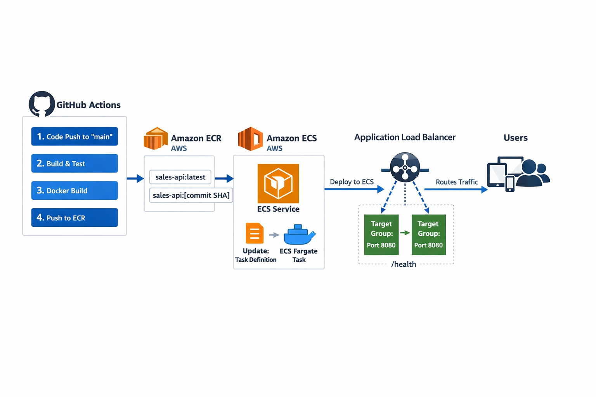

# Sales API

REST API em produção para gerenciamento de usuários, clientes e assinaturas, desenvolvida com **Java 17 + Spring Boot** e deployada na AWS utilizando **ECS (Fargate), RDS, Application Load Balancer** e pipeline completo de **CI/CD com GitHub Actions**.

O projeto implementa **autenticação JWT**, **arquitetura em camadas**, **testes unitários com Mockito e JUnit** e **testes de integração com Testcontainers**.

---

# 🌍 Live API

API disponível publicamente:

🌍 **API Base URL:**
http://sales-api-alb-518657079.us-east-2.elb.amazonaws.com

📚 **Swagger UI:**
http://sales-api-alb-518657079.us-east-2.elb.amazonaws.com/swagger-ui/index.html


Através do Swagger é possível:

- visualizar todos os endpoints
- testar requisições
- autenticar utilizando JWT

---

# 🚀 Technologies

**Tech Stack:**
- Java 17 & Spring Boot → API REST com arquitetura limpa
- Spring Security + JWT → Autenticação e autorização seguras
- Spring Data JPA + MySQL → Persistência robusta
- Docker & Docker Compose → Containerização e facilidade de deploy
- JUnit 5 & Mockito → Testes unitários da camada de serviço
- AWS ECS (Fargate) → cluster gerenciado pela Amazon
- AWS RDS → Persistência em banco gerenciado pela Amazon
- Docker Hub e AWS ECR → O primeiro para backup de imagem Docker e o segundo para comunicação interna AWS e deploy
- AWS Application Load Balancer → para controle de tráfego e direcionamento para a task ECS
- GitHub Actions (CI/CD) -> script para automação do processo de integração e deploy

---

# 🏗 Architecture

O projeto segue **arquitetura em camadas**, separando responsabilidades:

Controller → Camada de entrada HTTP
Service → Regras de negócio
Repository → Persistência com JPA
Entity → Representação das tabelas do banco
DTO → Transferência de dados entre camadas
Security → Autenticação e autorização JWT
GlobalExceptionHandler → Tratamento centralizado de erros

---

Essa estrutura melhora:

- manutenção
- testabilidade
- escalabilidade

---

## 🏗️ Arquitetura da Aplicação à nível CI/CD

Aplicação containerizada seguindo arquitetura em camadas, executando em ambiente distribuído na AWS através do ECS (Fargate) e exposta via Application Load Balancer.



---

# ⚙️ CI/CD Pipeline

O projeto possui pipeline automatizado com GitHub Actions:

- Build e testes com Maven
- Build de imagem Docker
- Push para AWS ECR
- Push para Docker Hub como backup
- Versionamento de imagens com SHA do commit
- Atualização automática da Task Definition
- Deploy automatizado no ECS com atualização da Task Definition
- Integração com Application Load Balancer

Cada push na branch `main` dispara automaticamente o processo de deploy.

---

# 📌 Principais Features

- CRUD completo de Customers e Subscriptions com relacionamento
- Autenticação segura com JWT e roles (ADMIN / USER)
- Validação e tratamento global de erros
- Containerização com Docker & Docker Compose
- Testes unitários com Mockito
- Testes de integração com Testcontainers

---

# 🔐 Authentication

A API utiliza autenticação baseada em **JWT**.

### Login

`POST /auth/login`

Exemplo de requisição:

```json
{
  "email": "admin@email.com",
  "password": "123456"
}
```


Após autenticação, a API retorna um **token JWT**.

Esse token deve ser enviado no header das requisições protegidas:

Authorization: Bearer <JWT_TOKEN>

O Swagger permite autenticação através do botão **Authorize**.

Endpoints que não necessitam de autenticação e não exigem autorização:

`POST /auth/login`
`POST /v1/users`

Certifique-se de definir o campo `"role" : "ADMIN"` na criação de um usuário para acesso total aos endpoints.
---

# 📡 Main Endpoints


`POST /auth/login`

`GET /v1/users`
`GET /v1/users/{id}`
`POST /v1/users`
`PUT /v1/users/{id}`
`DELETE /v1/users/{id}`

`GET /v1/customers`
`GET /v1/customers/{id}`
`POST /v1/customers`
`PUT /v1/customers/{id}`
`DELETE /v1/customers/{id}`

`GET /v1/subscriptions`
`GET /v1/subscriptions/{id}`
`POST /v1/subscriptions`
`PUT /v1/subscriptions/{id}`
`DELETE /v1/subscriptions/{id}`

---

# 🧪 Tests

O projeto possui **testes unitários na camada de serviço** utilizando:

- JUnit 5
- Mockito
- Testcontainers

Para rodar os testes:

mvn test

---

# 💻 Running Locally

Clone o repositório:

```bash
git clone https://github.com/joaofuzeto/personal-project
cd sales-api
```

Rodar com Docker:
```bash
docker compose up --build
```

A aplicação estará disponível em:

http://localhost:8080

---

# 🗄 Database

O projeto utiliza **MySQL** como banco de dados.

A configuração é feita através de variáveis de ambiente:

```env
SPRING_DATASOURCE_URL=jdbc:mysql://localhost:3306/sales_db
SPRING_DATASOURCE_USERNAME=root
SPRING_DATASOURCE_PASSWORD=senha
JWT_SECRET=supersecretkey
```

---

# 📈 Future Improvements

- Logging estruturado
- Monitoramento da aplicação

---

# 👨‍💻 Author

**João Victor Fuzeto Nascibem**

Backend Developer | Java | Spring Boot

<div>
  <a href= "https://www.linkedin.com/in/joao-fuzeto" target= "_blank"> </a>
</div>

